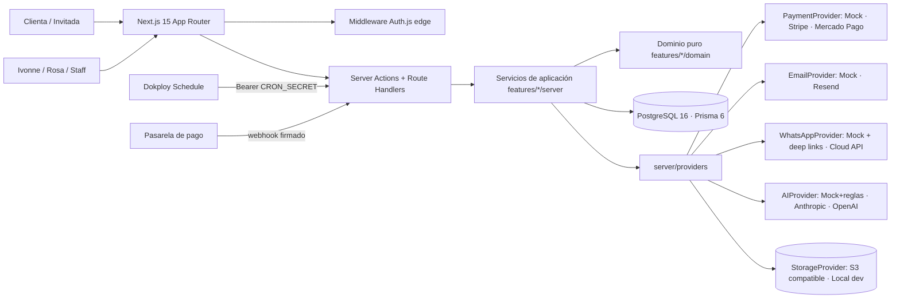
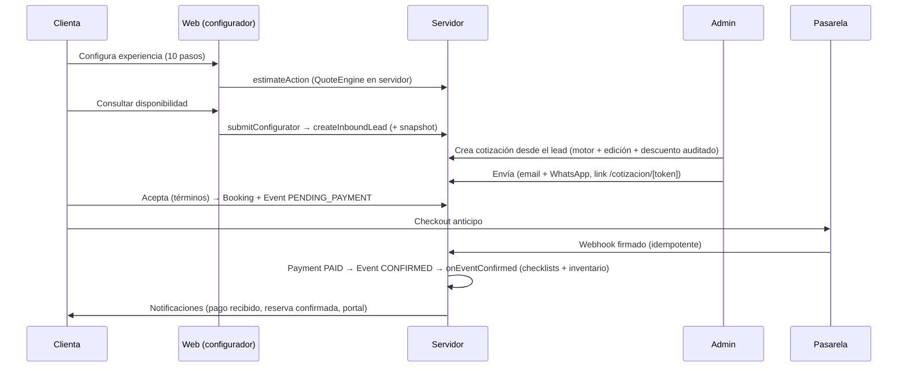

# Arquitectura

## Visión

Un **modular monolith** en Next.js 15 (App Router) que funciona como sistema operativo del negocio:
vende (commerce), opera (operations), eleva la experiencia (experience) y mide (intelligence).
Se despliega como **un contenedor Docker** en Dokploy con PostgreSQL y un bucket S3 compatible.

## Capas

| Capa | Dónde | Regla |
|---|---|---|
| UI | `src/app/**`, `src/components/**`, `src/features/*/components` | Sin reglas de negocio. RSC por defecto; `"use client"` sólo para interacción. |
| Aplicación | `src/features/*/server/*-service.ts`, `actions.ts`, `queries.ts` | Orquesta transacciones, autoriza (RBAC), audita, notifica. Servicios reciben el actor explícito. |
| Dominio | `src/features/*/domain/*.ts` | Puro y determinista: `QuoteEngine`, disponibilidad, máquinas de estado, finanzas, reglas de IA, validación de archivos, reglas de recordatorios. 100% probado con Vitest. |
| Infraestructura | `src/server/providers/*`, `src/db`, `src/lib/rate-limit.ts` | Adapters intercambiables con contratos (`PaymentProvider`, `EmailProvider`, `WhatsAppProvider`, `AIProvider`, `StorageProvider`). |

### Contratos transversales (fase Foundation)

- `@/features/quotes/domain/quote-engine` — `calculateQuote`, `calculateFromLines` (precios, invitadas extra, add-ons, logística, descuentos, IVA, costo, margen, anticipo).
- `@/features/quotes/server/pricing` — catálogo DB → motor (`estimateSelection`, `publicEstimate` sin costos).
- `@/features/bookings/server/availability-service` — `checkAvailability`, `getRangeAvailability`.
- `@/features/leads/server/lead-intake` — `createInboundLead` (configurador, IA, contacto, manual).
- `@/features/events/server/lifecycle` — `onEventConfirmed` (checklists + reservas de inventario).
- `@/features/media/server/upload-service` / `media-url` — subida validada y URLs firmadas.
- `@/features/notifications/server/notification-service` — `notify`, `notifyCustomer` (siempre `NotificationLog`).
- `@/server/action` — `protectedAction` / `publicAction` (Zod + RBAC + rate limit + errores con `errorId`).
- `@/server/audit`, `@/server/analytics`, `@/lib/flags`, `@/features/settings/server/settings-service`.

## Flujos principales

### Venta (configurador → lead → cotización → anticipo → evento confirmado)

### Experiencia (portal → invitadas → RSVP → evento → memory capsule)

Portal `/mi-evento/[token]` (pago de saldo, invitadas, preferencias, mensajes) → micrositio
`/e/[slug]/[token]` (RSVP, alergias, mensaje para la homenajeada) → operación (orden de producción,
checklists, staff, inventario, compras) → cierre financiero → `/memory/[token]` + reseña.

## Estados

- Lead: `NEW → CONTACTED → QUALIFIED → QUOTED → WON | LOST`
- Quote: `DRAFT → SENT → ACCEPTED | REJECTED | EXPIRED` (nuevas versiones regresan a DRAFT)
- Event (incluye la reserva): `INQUIRY → PENDING_PAYMENT → CONFIRMED → PLANNING → READY → IN_PROGRESS → COMPLETED` (+ `CANCELLED`)
- Payment: `PENDING → PAID → PARTIAL_REFUND → REFUNDED` (+ `FAILED`)
- Purchase: `REQUESTED → ORDERED → RECEIVED` (+ `CANCELLED`)

Todas declaradas en `features/*/domain/*-status.ts` y validadas con `.assert(from, to)`.

## Datos

PostgreSQL con Prisma. Dinero en centavos (Int), porcentajes en bps, fechas UTC (zona de negocio
`America/Mexico_City`), IDs `cuid`, códigos legibles no secuenciales para humanos (`L-2610-7KQ3`),
tokens públicos de 256 bits. JSON sólo en snapshots y configuración. Ver `docs/DOMAIN.md`.

## Rendimiento

- Páginas públicas renderizadas en servidor, consultas cacheadas (`unstable_cache` + tags), imágenes con `next/image` (AVIF/WebP, lazy).
- Sin librerías pesadas (gráficas en SVG propio, sin SDKs de pago/IA: `fetch`).
- Build `standalone` para imagen Docker mínima.

## Escalabilidad futura

El monolito separa dominios por carpeta y contratos; candidatos a extraer cuando haya volumen:
worker de notificaciones (cola Redis), procesamiento de medios (thumbnails/auto-video), BI.
